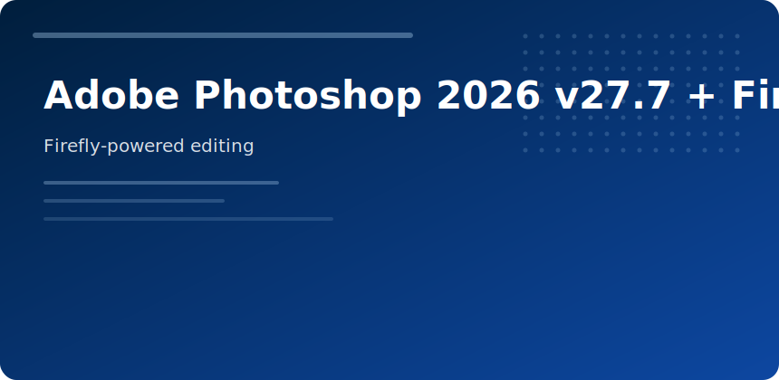

  

  

# Adobe Photoshop 2026 v27.7 + Firefly AI

 

v27.7 tightens **generative fill** latency and adds batch-aware Firefly actions for e-commerce packs.

## Tool clusters

| Cluster | Tasks |
|---------|-------|
| Select & Mask | hair, fur, glass |
| Camera Raw | batch RAW normalize |
| Neural Filters | depth blur, color match |
| Firefly | remove, extend, replace |

## Production habits

- Smart objects for non-destructive stacks
- Linked libraries for brand assets
- Actions for resize/watermark exports

## Export

WebP/AVIF for web; TIFF 16-bit for archival masters.

adobe photoshop 2026 firefly ai generative retouching compositing
